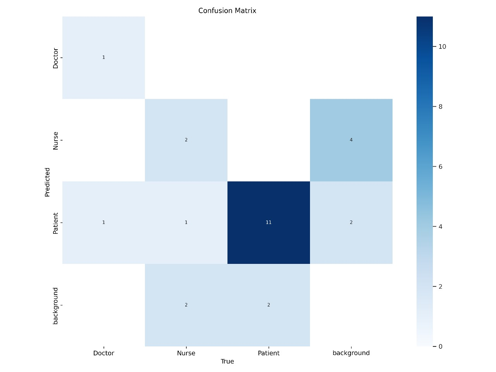
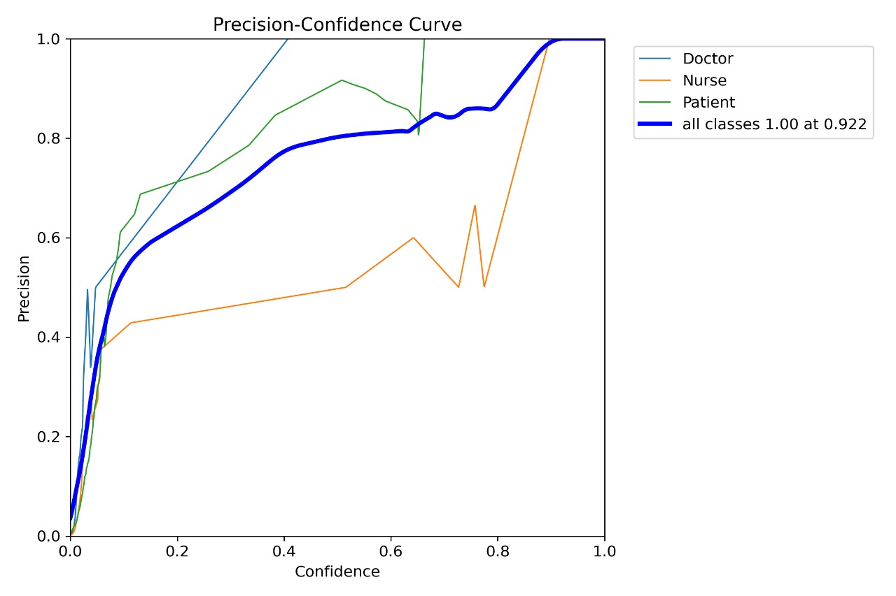
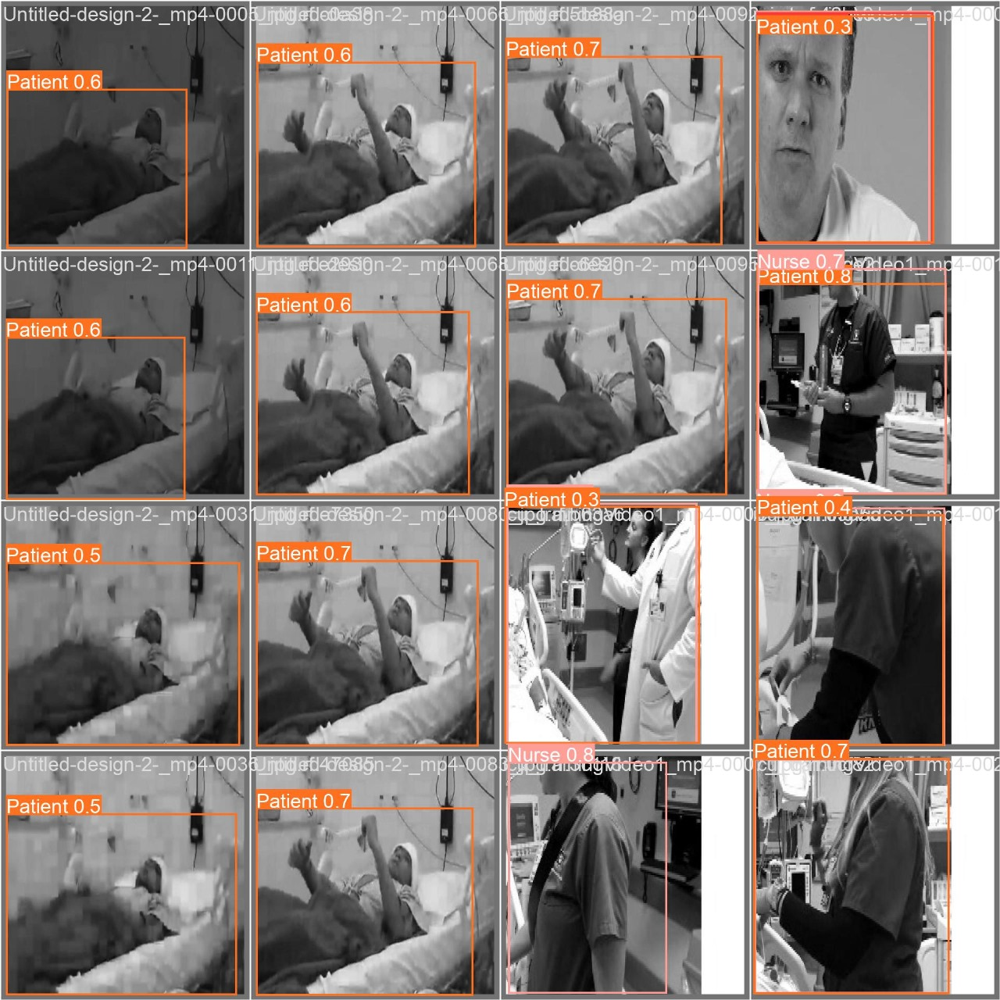

# TeleICU Patient Monitoring System

## Overview
TeleICU is a computer vision–based remote patient monitoring system designed to assist healthcare professionals in observing ICU patients using video analytics. The system aims to enable continuous monitoring and early detection of critical events in intensive care units, especially in resource-constrained settings.

This project was developed as part of the **Intel® Unnati Industrial Training – 2024** at VIT Bhopal University.

---

## Problem Statement
Intensive Care Units require constant patient monitoring, which is resource-intensive and prone to human fatigue and delays. In remote or understaffed hospitals, continuous supervision by trained professionals is often not feasible.

---

## Proposed Solution
The system leverages **video processing and deep learning** to automatically monitor ICU environments. By analyzing video feeds in real time, it detects patient presence, staff movement, and abnormal motion patterns, enabling timely alerts and improved patient care.

---

## System Components
The solution consists of three major modules:

- **Person Identification & Classification:**  
  Detects and classifies individuals in ICU scenes (Patient, Doctor, Nurse, Background) using YOLO-based object detection.

- **Movement Detection:**  
  Identifies motion in ICU video feeds using frame differencing and image processing techniques.

- **Movement Classification:**  
  Classifies detected motion into activities such as walking, standing, or seizure-like movements using background subtraction and contour analysis.

---

## Technologies Used
- Python  
- OpenCV  
- YOLO (Object Detection)  
- Deep Learning  
- NumPy  
- Jupyter Notebook  

---

## Results

### Confusion Matrix
  
Note: Some class confusion is observed due to class imbalance and visual similarity in ICU environments.

### Precision vs Confidence Curve
  
Precision improves with higher confidence thresholds, indicating reliable predictions when the model is confident.

### Sample Prediction Output

---

## Internship & Acknowledgement
This project was completed under the **Intel® Unnati Industrial Training – 2024** program.  
Mentor: Dr. Soumitra Keshari Nayak  
Institution: VIT Bhopal University

---

## Conclusion
The TeleICU monitoring system demonstrates the potential of computer vision and deep learning to enhance critical care by enabling continuous, automated patient monitoring. The approach supports early detection of abnormal events, improves response time, and optimizes healthcare resources, making it a promising solution for modern TeleICU environments.

---

## Author
Misra Vatsala  
ECE Graduate (2025)
